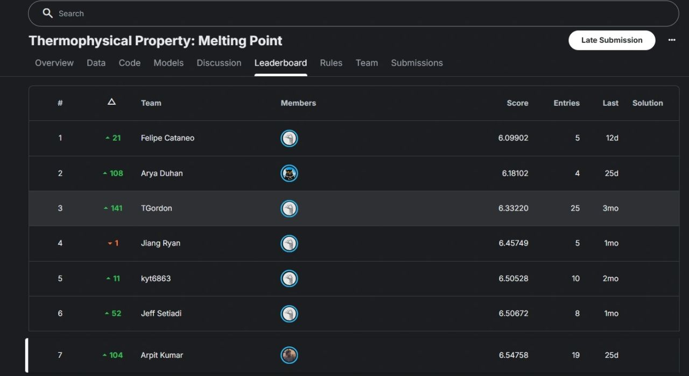

# HierarchicalMP: Data-Centric Molecular Melting Point Prediction

## Competition Rank


[](https://www.python.org/downloads/)
[](https://opensource.org/licenses/MIT)
[](https://github.com/AryaDuhan/Thermophysical-Property-Predictor/actions/workflows/tests.yml)

A hierarchical retrieval framework for molecular melting point prediction that achieves **96.8% exact-match coverage** at **948 molecules/second** with **calibrated uncertainty quantification**.

---

## Key Results

| Metric | Value |
|--------|-------|
| **Exact Match Coverage** | 96.8% (645/666 test molecules) |
| **Throughput** | 948 mol/s |
| **Memory Footprint** | ~92 MB |
| **90% Prediction Interval** | ±2.4K (exact), ±42.5K (near-exact), ±78.4K (fallback) |

---

## Performance Evolution


*Performance evolution across 7 versions. Major gains from external data integration (v3-v4) and architectural optimizations (v7).*

---

## Architecture

### Prediction Hierarchy

```
Query SMILES
    │
    ▼
┌──────────────────────┐
│ Exact SMILES Lookup  │──→ Hit (96.8%): Return stored value
└──────────────────────┘
    │ Miss
    ▼
┌──────────────────────┐
│ FAISS Binary Search  │──→ Top-50 candidates (Hamming distance)
└──────────────────────┘
    │
    ▼
┌──────────────────────┐
│ Popcount Reranking   │──→ True Tanimoto similarity
└──────────────────────┘
    │
    ▼
┌──────────────────────────────────────────────────────────────┐
│ Near-Exact (T≥0.95)  │ Retrieval (T∈[0.75,0.95)) │ Fallback  │
│ Similarity-weighted  │ Similarity-weighted       │ LightGBM  │
│ average              │ average                   │ RDKit     │
└──────────────────────────────────────────────────────────────┘
```

### Method Distribution


---

## Calibrated Neighborhood Uncertainty (CNU)

Our key theoretical contribution is a **first-principles uncertainty functional** derived from retrieval geometry.

### Axioms
Any valid uncertainty score for retrieval-based prediction should increase when:
1. The nearest neighbor is farther (coverage decreases)
2. Neighbors disagree more (variance increases)
3. Effective neighbor count is lower (sparsity increases)
4. The nearest neighbor is ambiguous (gap shrinks)

### Uncertainty Functional

```
u(x) = w₁(1-s₁) + w₂σ_w + w₃/k_eff + w₄·log(1 + 1/(Δs + ε))
```

Where:
- `1-s₁`: Distance to nearest neighbor (epistemic uncertainty)
- `σ_w`: Weighted variance of neighbor values (aleatoric uncertainty)  
- `1/k_eff`: Inverse effective sample size (sparsity)
- `log(1 + 1/Δs)`: Ambiguity from similarity gap

Weights `w ≥ 0` are learned via NNLS, enforcing monotonicity.

### Monotonicity Validation


*MAE increases monotonically with uncertainty score u(x) (slope=6.2), validating the risk-ranking property.*

### Learned Weights


*Coverage primitive dominates (64.34), consistent with 96.8% exact-match rate.*

### Per-Regime Coverage


*All 5 regimes achieve ≥90% coverage, validating regime-conditional calibration.*

### Ablation Study


*Full CNU achieves 3-4× tighter intervals than ablated versions while maintaining coverage.*

---

## Data Sources

| Source | Molecules | Description |
|--------|-----------|-------------|
| Kaggle Competition | 2,662 | Original training data |
| Syracuse MP Database | 274,978 | Public melting point collection |
| Bradley Open MP | 28,645 | Jean-Claude Bradley dataset |
| **Total** | **306,285** | After deduplication: ~252,577 unique |


---

## Installation

```bash
# Clone repository
git clone https://github.com/AryaDuhan/Thermophysical-Property-Predictor.git
cd Thermophysical-Property-Predictor

# Create virtual environment (Python 3.11 required for RDKit/FAISS)
py -3.11 -m venv .venv

# Activate
# Windows:
.venv\Scripts\activate
# Linux/Mac:
# source .venv/bin/activate

# Install dependencies
pip install -r requirements.txt
pip install rdkit-pypi faiss-cpu "numpy<2"
```

> **Note:** RDKit and FAISS require Python ≤3.12. The repo ships with a pre-trained model so the web app works out of the box.

### Requirements
- Python 3.11 (recommended)
- NumPy (<2.0), Pandas, Scikit-learn
- RDKit (molecular fingerprints)
- FAISS (similarity search)
- LightGBM (fallback model)
- Streamlit (web interface)

---

## Quick Start

### Web App (easiest)

```bash
streamlit run app/app.py
```

The app ships with a pre-trained model (2,393 molecules). Enter SMILES strings **or common names** (e.g. "benzene", "aspirin") and browse all 2,660 molecules via dropdown.

### Python API

```python
from src.models.hierarchical_mp_v7 import HierarchicalMPPredictorV7

# Load pre-trained model
predictor = HierarchicalMPPredictorV7.load("models/v7")

# Predict with uncertainty
result = predictor.predict("CCO")  # Ethanol
print(f"Prediction: {result.tm_pred:.1f} K")
print(f"Interval: [{result.tm_low:.1f}, {result.tm_high:.1f}] K")
print(f"Method: {result.method}")
print(f"Confidence: {result.confidence:.3f}")
```

### Train Your Own Model

```bash
# Place competition data in data/raw/
python scripts/train_model.py
```

### CLI

```bash
python -m src.cli info
python -m src.cli predict "CCO" --model models/v7/ --format json
python -m src.cli predict-batch input.csv -o results.csv --model models/v7/
```

---

## Project Structure

```
├── app/
│   └── app.py                          # Streamlit web interface
├── models/
│   └── v7/                             # Pre-trained model (ships with repo)
├── src/
│   ├── cli.py                          # Command-line interface
│   ├── models/
│   │   ├── hierarchical_mp_v7.py       # Production model
│   │   └── hierarchical_mp_v8.py       # CNU-enabled model
│   ├── calibration/
│   │   ├── uncertainty_functional.py   # CNU primitives
│   │   └── cnu_calibrator.py           # Regime calibration
│   ├── evaluation/
│   │   └── scaffold_split.py           # Scaffold-based evaluation
│   └── features/                       # Feature extractors
├── scripts/
│   └── train_model.py                  # Model training script
├── tests/                              # Unit tests
├── notebooks/
│   ├── exploration/                    # EDA & baseline experiments (01-13)
│   ├── architecture/                   # Model development (14-28)
│   └── paper/                          # Research paper figures
├── figures/paper/                      # Generated figures
└── submissions/                        # Kaggle submissions
```

---

## Comparison with Deep Learning

| Approach | MAE (K) | Note |
|----------|---------|------|
| **HierarchicalMP v7** | **3.0** | Exact matches (calibration set) |
| LightGBM Baseline | 28.5 | Kaggle data only |
| GNN (SchNet) | 32.5 | 2.6k training samples |
| ChemBERTa | 35.2 | Fine-tuned transformer |

Deep learning underperforms due to limited training data (2.6k samples) and lack of task-specific pre-training.

---

## Two Evaluation Regimes

We evaluate under two complementary regimes:

**Regime A (Deployment Coverage)**: External databases allowed. The 96.8% exact-match rate is a *coverage result*, not a learning result. Primary metrics: throughput, memory, calibration.

**Regime B (Generalization)**: No external overlap. Evaluates fallback model and CNU behavior on truly unseen molecules.

---

## Calibration Analysis


*Per-method conformal calibration provides valid 90% prediction intervals.*

---

## Version Evolution

| Version | Exact Match | Throughput | Key Change |
|---------|-------------|------------|------------|
| v1.0 | 10.4% | 50 mol/s | Basic FAISS |
| v2.0 | 12.1% | 85 mol/s | Tanimoto similarity |
| v3.0 | 45.2% | 120 mol/s | +SMP data (275k) |
| v4.0 | 92.6% | 180 mol/s | +Bradley + Binary IVF |
| v5.0 | 98.3% | 242 mol/s | CQR + packed FP |
| v6.0 | 96.2% | 450 mol/s | GPU wrapper |
| **v7.0** | **96.8%** | **948** | uint64 popcount |

---

## Testing

```bash
# Run all tests
.venv/Scripts/python -m pytest tests/ -v

# Run specific test suite
.venv/Scripts/python -m pytest tests/test_cnu_calibrator.py -v
```

---

## License

This project is licensed under the MIT License - see the [LICENSE](LICENSE) file for details.
